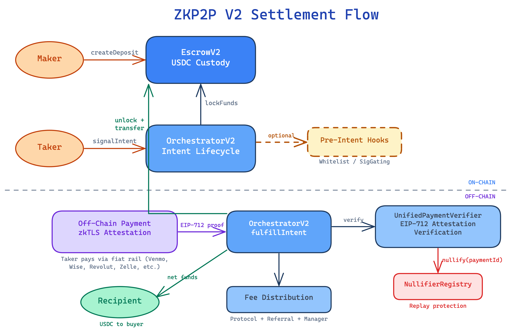
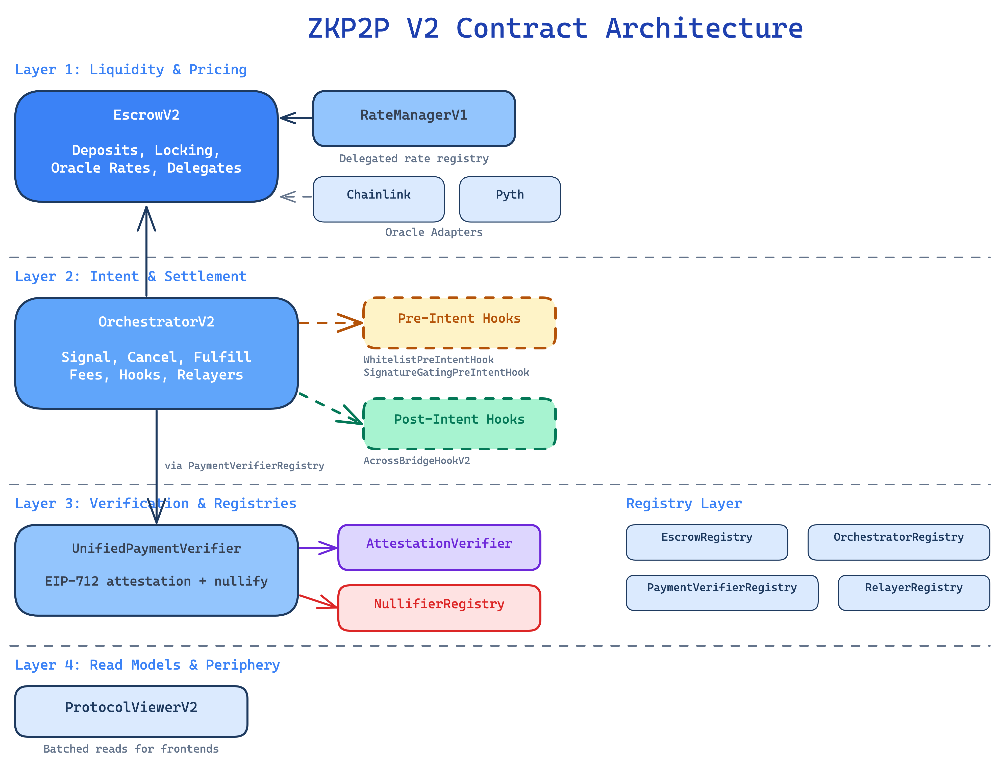

# zkp2p-v2-contracts

[](https://codecov.io/gh/zkp2p/zkp2p-contracts)

Smart contracts for the ZKP2P fiat on/off-ramp, with the current repository centered on the v2 system.
The pristine deployed pre-cut `OrchestratorV2` source is archived outside the compilation tree.

- `EscrowV2`: maker liquidity, per-deposit payment configuration, oracle-backed pricing, delegated rate managers.
- `OrchestratorV2`: intent lifecycle, fee handling, pre-intent hooks, whitelist hooks, post-intent execution, and unrestricted account-level concurrency.
- `UnifiedPaymentVerifierV2`: shared attestation-based verifier registered across supported payment methods.
- `ProtocolViewerV2`: batched read model for deposits, intents, supported payment methods, and effective rates.

The repository still contains legacy v1 contracts and deploy scripts because v2 is deployed on top of shared protocol infrastructure, but the active development work over the last month has been concentrated in the v2 contracts, periphery, and deployment pipeline.

## Table of Contents

- [What Landed Recently](#what-landed-recently)
- [System Overview](#system-overview)
- [V2 Contract Inventory](#v2-contract-inventory)
- [Core Lifecycle](#core-lifecycle)
- [Rate Management Model](#rate-management-model)
- [Hooks and Extensibility](#hooks-and-extensibility)
- [Payment Verification Model](#payment-verification-model)
- [Repository Layout](#repository-layout)
- [Getting Started](#getting-started)
- [Build, Test, and Development Commands](#build-test-and-development-commands)
- [Deployment Model](#deployment-model)
- [Supported Payment Methods](#supported-payment-methods)
- [Testing Strategy](#testing-strategy)
- [Networks and Deployment Artifacts](#networks-and-deployment-artifacts)
- [Security Notes](#security-notes)

## What Landed Recently

The v2 surface was built out rapidly between February 20, 2026 and March 11, 2026. The main additions in that window are:

- `2026-03-02`: `EscrowV2`, `OrchestratorV2`, `ProtocolViewerV2`, `RateManagerV1`, `AcrossBridgeHookV2`, `SignatureGatingPreIntentHook`, `WhitelistPreIntentHook`, `ChainlinkOracleAdapter`, `OrchestratorRegistry`, and the supporting v2 interfaces/mocks/tests landed.
- `2026-03-02`: the dedicated v2 deployment pipeline landed in `deploy/14_deploy_v2_system.ts`, `deploy/15_deploy_v2_periphery.ts`, and `deploy/16_configure_v2_payment_methods.ts`, with matching deployment tests.
- `2026-03-03`: `PythOracleAdapter` and its deployment/test coverage were added for Pyth FX feeds.
- `2026-03-04`: mainnet deployment scripts for `EscrowV2`, `OrchestratorV2`, and `RateManagerV1` landed.
- `2026-03-06`: the rate-floor model was refactored so `EscrowV2` enforces the final floor while `RateManagerV1` acts as a pure delegated rate registry.
- `2026-03-11`: `EscrowV2` gained batch currency/oracle configuration setters, including `setOracleRateConfigBatch`, `updateCurrencyConfigBatch`, and `deactivateCurrenciesBatch`.
- `2026-03-11`: `EscrowV2` added support for negative oracle spreads, allowing makers to quote below the oracle market rate while still preserving a positive multiplier invariant.
- `2026-03-11`: `OrchestratorV2` added support for multi-recipient referral fees, with `ReferralFeeLib` and updated interfaces/tests.
- `2026-03-11`: a staging redeploy script for `EscrowV2`, `OrchestratorV2`, and `SignatureGatingPreIntentHook` landed in `deploy/19_redeploy_escrowv2_orchestratorv2_staging.ts`.

In practice, "the latest contracts we have added in the past month" means the README should be read as a v2-first document.

## System Overview

ZKP2P is a non-custodial fiat-to-crypto settlement protocol. Makers deposit on-chain liquidity, takers lock a portion of that liquidity by signaling an intent, a payment proof is verified on-chain against an off-chain attestation, and settlement completes either directly to the taker or through a post-intent hook.

The v2 system is built around four layers:

1. Liquidity custody and pricing.
   `EscrowV2` stores deposits, payment methods, payee hashes, supported fiat currencies, fixed floors, oracle configs, rate-manager delegation, and outstanding intents.
2. Intent coordination and settlement.
   `OrchestratorV2` validates whether a taker can lock liquidity, snapshots fee terms and min intent size, verifies payments through the registry-selected verifier, and releases funds.
3. Verification and registries.
   `UnifiedPaymentVerifier` validates EIP-712 attestations and nullifies payments. Active registries define which escrows, orchestrators, hooks, and payment methods are valid. `RelayerRegistry` backs the deployed legacy V1 stack and the deployed prod `OrchestratorV2`; the active `OrchestratorV3` has no relayer dependency.
4. Read models and periphery.
   `ProtocolViewerV2`, oracle adapters, bridge hooks, and pre-intent hooks provide the ergonomic layer used by frontends, routing systems, and privileged operators.

### High-Level Flow



### Contract Architecture



## V2 Contract Inventory

This section covers the current v2 contracts and why each exists.

### Core Contracts

#### `EscrowV2`

`EscrowV2` is the v2 liquidity layer. Each deposit stores:

- depositor and optional delegate
- deposit token
- min/max per-intent amount range
- whether the deposit is currently accepting intents
- optional intent guardian
- optional `retainOnEmpty` behavior so the deposit configuration can survive empty liquidity
- per-payment-method verification data
- per-payment-method supported currencies
- per-currency fixed minimum conversion rates
- optional per-currency oracle rate configuration
- optional delegated rate manager configuration

Notable v2 behavior:

- Supports `createDeposit` and `depositTo`, so contracts can fund deposits on behalf of makers.
- Tracks outstanding intents inside escrow and reclaims liquidity when expired intents are pruned.
- Allows a delegate to manage deposit configuration without ownership transfer.
- Supports oracle-based pricing through `OracleRateConfig` with:
  - `adapter`
  - normalized `adapterConfig`
  - signed `spreadBps`
  - `maxStaleness`
- Supports negative oracle spreads as of March 11, 2026.
- Supports delegated pricing via `RateManagerV1`.
- Exposes batch management APIs for currency/oracle updates.

Important v2 management APIs include:

- `setOracleRateConfig`
- `setOracleRateConfigBatch`
- `updateCurrencyConfigBatch`
- `deactivateCurrenciesBatch`
- `setRateManager`
- `clearRateManager`
- `getEffectiveRate`
- `getManagerFee`

#### `OrchestratorV2`

`OrchestratorV2` is the settlement coordinator. It owns the intent lifecycle:

- `signalIntent`
- `cancelIntent`
- `fulfillIntent`
- `releaseFundsToPayer`
- `cleanupOrphanedIntents`
- escrow-driven `pruneIntents`

Key v2 behavior:

- Validates escrow and payment-method support through registries.
- Locks liquidity on signal and unlocks/releases on cancel or fulfill.
- Snapshots the deposit minimum at signal time to prevent sub-minimum fulfillments later.
- Snapshots delegated manager fee terms at signal time.
- Supports a generic pre-intent hook and a dedicated whitelist hook per deposit.
- Supports optional post-intent hooks through `IPostIntentHookV2`.
- Distributes protocol fees, manager fees, and multiple referral fees.
- Allows every account to hold multiple concurrent intents; V3 admission is governed only by the selected risk hook.

Recent addition:

- Multi-recipient referral fee support landed on March 11, 2026.

#### `ProtocolViewerV2`

`ProtocolViewerV2` is the read-model contract for apps and indexers that need a single call to return:

- a deposit plus all configured payment methods
- effective per-currency rates after floor/oracle/manager logic
- outstanding intent hashes
- reclaimable liquidity from expired intents
- intents joined with their backing deposits

It is stateless and exists to make frontend queries cheaper and simpler.

#### `RateManagerV1`

`RateManagerV1` is the delegated rate registry used by `EscrowV2`.

It stores manager-owned pricing state keyed by a `rateManagerId`:

- manager address
- fee recipient
- fee and max fee
- minimum liquidity requirement
- display metadata (`name`, `uri`)
- per-payment-method / per-currency rates

Important semantics:

- As of March 6, 2026, `RateManagerV1` is a pure registry; floor enforcement is handled inside `EscrowV2`.
- Escrows opt into a manager via `setRateManager`.
- Managers can update one rate or batches of rates.
- The manager fee is snapshotted in `OrchestratorV2` when the taker signals an intent.

### Hook Contracts

#### `WhitelistPreIntentHook`

A depositor-managed private-orderbook mechanism:

- whitelist specific taker addresses per `escrow + depositId`
- only authorized orchestrators may invoke it
- used through the dedicated whitelist hook slot in `OrchestratorV2`

#### `SignatureGatingPreIntentHook`

An off-chain allowlist / RFQ gate:

- the deposit owner or delegate sets an authorized signer per deposit
- the taker includes ephemeral hook data with a signature and expiration
- the hook verifies a payload bound to:
  - orchestrator
  - escrow
  - deposit
  - amount
  - taker
  - recipient
  - payment method
  - fiat currency
  - conversion rate
  - referral fee hash
  - expiration
  - chain id

This is useful for private liquidity, per-trade approval, or off-chain risk checks.

#### `AcrossBridgeHookV2`

A post-intent hook that bridges fulfilled tokens through Across `depositNow`.

Design constraints:

- intended for stablecoin-to-stablecoin routes
- the signal step commits destination chain, output token, recipient, and minimum output amount
- the fulfill step supplies just-in-time Across route data
- if the bridge cannot proceed, the hook falls back to a direct source-chain transfer instead of reverting the entire settlement

That fallback behavior is important because the user may already have made the off-chain fiat payment.

### Oracle Adapters

#### `ChainlinkOracleAdapter`

- Accepts `abi.encode(address feed, bool invert)` raw config.
- Validates the feed and normalizes config to a compact packed format.
- Normalizes output to `1e18` precise units.
- Supports `feed == address(0)` as a constant `1.0` base rate, useful for USD-denominated USDC deposits.

#### `PythOracleAdapter`

- Added on March 3, 2026.
- Accepts `abi.encode(bytes32 feedId, bool invert)` raw config.
- Uses `Pyth.getPriceUnsafe` and returns a normalized `1e18` precise-unit rate plus publish time.
- Delegates staleness enforcement to `EscrowV2` via `maxStaleness`.

### Verifier Layer

#### `UnifiedPaymentVerifier` / `UnifiedPaymentVerifierV2`

The deployed v2 verifier uses the same contract implementation as `UnifiedPaymentVerifier`, but is deployed under the deployment name `UnifiedPaymentVerifierV2`.

Responsibilities:

- maintain the set of supported payment methods
- verify standardized EIP-712 payment attestations
- validate that the attested intent snapshot matches the live orchestrator intent
- nullify `(paymentMethod, paymentId)` combinations through `NullifierRegistry`
- emit normalized `PaymentVerified` events for off-chain reconciliation

#### `BaseUnifiedPaymentVerifier`

Shared base contract for:

- payment method configuration
- attestation verifier rotation
- orchestrator authorization
- nullifier writes

### Registry Layer

The v2 stack reuses and extends the existing registry model:

- `EscrowRegistry`: whitelists escrow contracts
- `OrchestratorRegistry`: whitelists both v1 and v2 orchestrators for escrow/verifier authorization
- `PaymentVerifierRegistry`: maps payment method hash to verifier and supported currencies
- `PostIntentHookRegistry`: whitelists post-intent hooks
- `RelayerRegistry`: backs deployed legacy V1 orchestrators and the deployed prod `OrchestratorV2`; not used by the active `OrchestratorV3`
- `NullifierRegistry`: stores consumed payment nullifiers

## Core Lifecycle

### 1. Maker Creates a Deposit

The maker funds `EscrowV2` and specifies:

- deposit token and amount
- min/max intent size
- supported payment methods
- per-method payee and verifier data
- per-method supported fiat currencies
- optional delegate
- optional intent guardian
- whether the deposit should remain configured after going empty

### 2. Deposit Pricing Is Defined

For each `(paymentMethod, currency)` pair, the deposit can use:

- a fixed floor only
- an oracle-backed rate with a spread
- a delegated manager rate through `RateManagerV1`

`ProtocolViewerV2` surfaces the final effective rate used by clients.

### 3. Taker Signals an Intent

`OrchestratorV2.signalIntent`:

- validates the escrow and deposit
- verifies payment-method and currency support
- runs the generic pre-intent hook, if present
- runs the dedicated whitelist hook, if present
- snapshots deposit min amount and manager fee terms
- stores the intent
- locks funds on `EscrowV2`

### 4. Fiat Payment Happens Off-Chain

The taker pays the maker using the selected payment rail. The off-chain attestation layer turns the payment evidence into a standardized signed payload.

### 5. Intent Is Fulfilled

`OrchestratorV2.fulfillIntent`:

- loads the stored intent
- resolves the correct verifier from `PaymentVerifierRegistry`
- verifies the payment proof
- checks the attested intent snapshot against on-chain data
- enforces the min-at-signal guarantee
- prunes the intent
- unlocks and transfers escrowed funds
- distributes protocol, referral, and manager fees
- optionally executes a post-intent hook

### 6. Expired Intents Can Be Reclaimed

If an intent expires:

- the escrow owner can reclaim liquidity during fund removal or withdrawal
- the orchestrator can prune orphaned intents
- `ProtocolViewerV2` exposes reclaimable liquidity so off-chain systems can model real availability

## Rate Management Model

Pricing is one of the biggest differences between the old system and v2.

### Fixed Floors

Every configured currency can carry a fixed minimum conversion rate. This is the hard floor that the settlement rate cannot violate.

### Oracle-Backed Floors

`EscrowV2` can derive rates from an oracle adapter plus a spread:

- Chainlink or Pyth supplies the base market rate.
- `spreadBps` adjusts the market rate.
- `maxStaleness` bounds stale data.
- The effective rate is returned in precise units.

Recent change:

- `spreadBps` is signed, so makers can quote above or below market. The implementation still requires the final multiplier to remain strictly positive.

### Delegated Managers

For programmatic market making, a deposit can delegate pricing to `RateManagerV1`:

- the deposit opts into a `rateManagerId`
- the manager updates rates off the critical settlement path
- `EscrowV2` combines manager-side rates with escrow-side floor enforcement
- `OrchestratorV2` snapshots the manager fee when the taker signals

This split keeps settlement safety inside escrow while letting pricing move quickly.

## Hooks and Extensibility

v2 introduces a clearer extension model around the intent lifecycle.

### Pre-Intent Hooks

Executed during `signalIntent`, before funds are locked:

- generic hook slot: arbitrary eligibility or policy checks
- whitelist hook slot: dedicated private-liquidity control

These hooks are configured per deposit by the depositor or delegate.

### Post-Intent Hooks

Executed during `fulfillIntent`, after verification and escrow release:

- direct recipient settlement remains the default
- hooks can route fulfilled funds into external workflows
- `AcrossBridgeHookV2` is the canonical example

### Registries as Safety Gates

The hook and orchestrator registry model prevents arbitrary external contracts from being inserted into the settlement path without explicit whitelisting.

## Payment Verification Model

The verification path is intentionally standardized across payment methods.

### Payment Method Registration

Each payment method is registered in two places:

1. `UnifiedPaymentVerifierV2` must recognize the payment method.
2. `PaymentVerifierRegistry` must map the method to the deployed verifier and its supported currencies.

### Attestation Model

The payment proof decodes into:

- payment details
- an intent snapshot
- witness signatures
- attested data and metadata

The verifier:

- reconstructs the EIP-712 digest
- checks the attestation through the configured attestation verifier
- validates the on-chain intent snapshot
- nullifies the payment ID
- returns the final release amount to `OrchestratorV2`

### Why the Nullifier Registry Matters

Payment IDs are nullified as `keccak256(paymentMethod, paymentId)` so the same raw ID cannot be replayed across methods.

## Repository Layout

```text
contracts/
  Escrow.sol
  EscrowV2.sol
  Orchestrator.sol
  OrchestratorV2.sol
  ProtocolViewer.sol
  ProtocolViewerV2.sol
  RateManagerV1.sol
  hooks/
  interfaces/
  lib/
  mocks/
  oracles/
  registries/
  unifiedVerifier/

archive/
  orchestrator-v2-pre-relayer-cut/  # pristine deployed legacy V2 source, excluded from compilation

deploy/
  00_deploy_system.ts
  01_deploy_unified_verifier.ts
  02_add_venmo_payment_method.ts
  ...
  14_deploy_v2_system.ts
  15_deploy_v2_periphery.ts
  16_configure_v2_payment_methods.ts
  17_deploy_pyth_oracle.ts
  18_redeploy_escrowv2_ratemanager.ts
  19_redeploy_escrowv2_orchestratorv2_staging.ts
  deploy_summary.ts

test-foundry/
  deterministic/
  fuzz/
  invariant/
```

## Getting Started

### Prerequisites

- Node.js 20.20.2 (the version pinned in CI)
- Yarn 4
- Foundry v1.7.1
- a `.env` copied from `.env.default`

### Initial Setup

```bash
corepack yarn install --immutable
cp .env.default .env
```

Fill the relevant environment variables, including the ones used by deployment and verification flows:

- `ALCHEMY_API_KEY`
- `BASE_DEPLOY_PRIVATE_KEY`
- `TESTNET_DEPLOY_PRIVATE_KEY`
- `BASESCAN_API_KEY`
- `ETHERSCAN_KEY`
- `INFURA_TOKEN`

### Local Development

Start a chain:

```bash
yarn chain
```

Deploy locally:

```bash
yarn deploy:localhost
```

For wallet-based local testing, import Hardhat account `#0` into your wallet.

## Build, Test, and Development Commands

### Core Commands

- `yarn compile`: compile Solidity contracts
- `yarn build`: clean, compile, generate typechain bindings, and transpile TypeScript
- `yarn clean`: remove compiler, coverage, and generated build artifacts
- `yarn typechain`: generate TypeChain bindings
- `yarn transpile`: run `tsc`

### Test Commands

- `corepack yarn test`: run the complete always-on Foundry suite
- `corepack yarn test:deterministic`: run deterministic parity, integration, and deployment tests
- `corepack yarn test:fuzz`: run the real-contract property suite at 512 cases per property
- `corepack yarn test:invariant`: run handler-driven invariants at 128 runs × 64 calls
- `forge test --match-path '<path>' --match-test '<name>'`: isolate a file or named test

See [TESTING.md](./TESTING.md) for suite design, seed reproduction, coverage mechanics, and contribution rules.

### Coverage

- `corepack yarn coverage`: run deterministic coverage once, build accurate Foundry LCOV, and enforce the permanent Foundry baseline floors

Coverage runs on every pull request and every push to `main`. Fuzz and invariant tests remain outside coverage but always run in the complete-suite job. The output is `coverage/lcov.info`; CI uploads it to the `foundry` Codecov flag through OIDC and fails visibly on upload errors.

### Packaging Commands

- `yarn pkg:extract`
- `yarn pkg:build`
- `yarn pkg:clean`
- `yarn pkg:test`

## Deployment Model

The deployment pipeline is layered because v2 reuses shared protocol infrastructure.

### Legacy Base System

Scripts `00` through `13` deploy and configure the original shared system and payment method scaffolding. These remain relevant because v2 builds on:

- existing registries
- the shared attestation verifier
- shared payment-method config artifacts

### V2 Deployment Sequence

#### `deploy/14_deploy_v2_system.ts`

Deploys and wires:

- `OrchestratorRegistry`
- `EscrowV2`
- `OrchestratorV2`
- `UnifiedPaymentVerifierV2` (same implementation as `UnifiedPaymentVerifier`)

Then it:

- adds both v1 and v2 orchestrators to `OrchestratorRegistry`
- adds `EscrowV2` to `EscrowRegistry`
- grants the v2 verifier write permissions in `NullifierRegistry`
- transfers ownership of the ownable v2 contracts to the configured multisig

#### `deploy/15_deploy_v2_periphery.ts`

Deploys:

- `WhitelistPreIntentHook`
- `SignatureGatingPreIntentHook`
- `AcrossBridgeHookV2`
- `RateManagerV1`
- `ChainlinkOracleAdapter`
- `ProtocolViewerV2`

Then registers `AcrossBridgeHookV2` in `PostIntentHookRegistry`.

#### `deploy/16_configure_v2_payment_methods.ts`

Configures the v2 verifier and registry for all supported methods:

- add payment methods to `UnifiedPaymentVerifierV2`
- repoint `PaymentVerifierRegistry` entries to the v2 verifier
- save payment method snapshots
- emit Safe batch calldata when the deployer is not the registry owner

This script currently covers:

- Venmo
- Revolut
- Cash App
- Wise
- Mercado Pago
- Zelle
- PayPal
- Monzo
- N26
- Alipay
- Chime
- Luxon

#### Additional Recent Deployment Scripts

- `deploy/17_deploy_pyth_oracle.ts`: deploys the Pyth adapter
- `deploy/18_redeploy_escrowv2_ratemanager.ts`: redeploys `EscrowV2` and `RateManagerV1` after the rate-floor refactor
- `deploy/19_redeploy_escrowv2_orchestratorv2_staging.ts`: staging-specific redeploy for `EscrowV2`, `OrchestratorV2`, and the signature-gating hook

#### Deployment Summary

`deploy/deploy_summary.ts` prints both legacy and v2 addresses and writes Safe Transaction Builder batch files when multisig actions are pending.

### Common Deployment Commands

- `yarn deploy:localhost`
- `yarn deploy:base`
- `yarn deploy:base_staging`

### Verification Commands

- `yarn etherscan:base`
- `yarn etherscan:base_staging`

## Supported Payment Methods

The repository contains deployment coverage for the following payment rails in the current v2 configuration flow:

- Venmo
- Revolut
- Cash App
- Wise
- Mercado Pago
- Zelle
- PayPal
- Monzo
- N26
- Alipay
- Chime
- Luxon

Payment-method specific provider configuration lives under `deployments/verifiers/`.

## Testing Strategy

Foundry is the sole contract test system. The suite is separated by assurance type:

- `test-foundry/deterministic/`: behavior parity, integration, deployment topology, events, reverts, state, balances, and authorization boundaries
- `test-foundry/fuzz/`: bounded real-contract properties that add input breadth beyond deterministic cases
- `test-foundry/invariant/`: multi-actor handlers, ghost accounting, lifecycle conservation, and nullifier uniqueness

The default `corepack yarn test` command runs every layer with the centrally configured run counts. CI has no event gates, reduced fuzz counts, live forks, pending cases, or ignored test failures. For ordinary development, run the affected file first and the complete command before pushing; run coverage whenever production or test behavior changes.

## Networks and Deployment Artifacts

The repo is configured primarily for:

- Base
- Base staging
- localhost / hardhat

Artifacts and exports live in:

- `deployments/<network>/`
- `deployments/outputs/`

The deploy scripts also reference current network parameters such as:

- USDC addresses
- multisig address
- protocol fee recipient
- dust recipient
- Across SpokePool address
- Pyth contract address

These parameters live in `deployments/parameters.ts`.

## Security Notes

- The contracts are designed around explicit registry-based authorization rather than open-ended plugin injection.
- `EscrowV2` and `OrchestratorV2` both use reentrancy guards on state-changing flows that interact with external contracts.
- Payment replay protection depends on `NullifierRegistry`.
- Oracle safety depends on both adapter validation and escrow-side `maxStaleness`.
- `AcrossBridgeHookV2` is intentionally biased toward successful settlement; it falls back to a direct transfer instead of reverting bridge failures.
- Manager fees are capped and snapshotted at signal time.
- The README is not a full audit report. Contract behavior should be read alongside the source and tests before making deployment or integration assumptions.

## License

MIT
