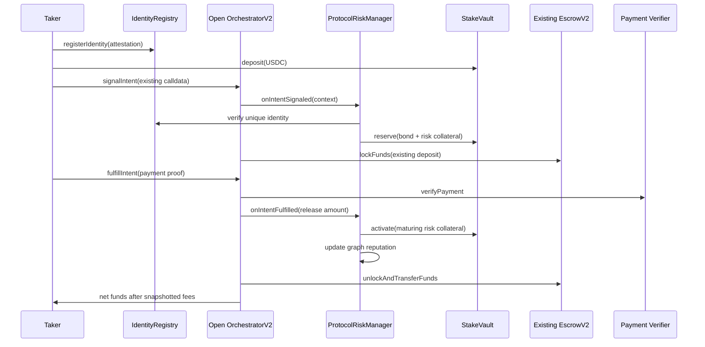

# Onchain Risk Architecture

## Components

### `IdentityRegistry`

- Verifies the existing `ZKP2PIdentityVerifier` EIP-712 attestation.
- Requires the attested wallet itself to submit registration; infrastructure
  cannot publish a permanent binding from a stale payload.
- Binds `(payment method, payeeIdHash)` to one wallet permanently.
- Allows multiple platform identities on one wallet.
- Supports emergency deactivation without freeing the identifier for a
  reputation reset.
- Supports explicit wallet quarantine so rotating the primary identity does
  not preserve access after fraud or compromise.
- Accepts only owner-allowlisted `register_*` action types, limiting accidental
  reuse of the portable attestation domain.
- Keeps trusted Attestor keys in public owner-managed state.

The current Attestor identity timestamps are milliseconds; the contract
deliberately compares them against `block.timestamp * 1_000`.

### `ReputationRegistry`

- Stores a signed score and auditable behavior counters.
- Stores a bounded edge per pair of verified identity nodes.
- Applies success, cancellation/expiry, and chargeback updates only from an
  authorized lifecycle reporter.
- Exposes scoring constants as governance state.

Default behavior:

- payment-proof-verified intent: new graph-edge weight only;
- cancelled intent: `-(10 + sqrt(amount / 1 USDC))`;
- expired intent: another `-10` on top of cancellation penalty;
- chargeback: `-(100 + sqrt(attested amount / 1 USDC))`.

Volume-derived contributions are capped by the edge cap.
Manual maker releases activate collateral but do not earn reputation, and a
taker cannot signal against its own deposit through the risk manager.

### `StakeVault`

- Custodies the configured stake token (USDC in the proposed deployment).
- Separates free, reserved, and locked balances.
- Reserves a signal bond and chargeback collateral at signal time.
- Releases the bond on fulfillment or transfers its configured slash to the
  maker on abandonment.
- Activates only the collateral needed for the verified release amount; excess
  reservation becomes free.
- Lets users checkpoint selected matured positions, avoiding unbounded arrays.
- Credits valid chargeback compensation to the maker's freely withdrawable
  vault balance, avoiding push-payment liveness failures.
- Keeps open-claim and pending-reputation holds in shared vault state so a new
  risk manager cannot bypass an old manager's unresolved negative event.

### `ProtocolRiskManager`

- Stores platform enablement, identity requirements, minimum reputation,
  signal bond, stake ratio, bond slash, and maturity schedule.
- Stores the ordered reputation tiers.
- Quotes and reserves signal-time capital without amount/count caps.
- Calls reputation and stake modules on fulfillment or abandonment.
- Verifies chain- and contract-bound chargeback EIP-712 attestations.
- Lets anyone close an access-only partial-claim hold after a 30-day Attestor
  finalization timeout; collateral and later valid attestations remain intact.

### `OrchestratorV2`

- Ignores legacy Curator gating signatures.
- Does not execute maker-controlled pre-intent or whitelist eligibility hooks.
- Rejects non-zero legacy eligibility-hook configuration once the risk manager
  is active; zero-risk legacy deployments preserve their old behavior.
- Allows multiple active intents per account.
- Calls and snapshots the current onchain risk manager.
- Applies the snapshotted reputation fee discount.
- Reports fulfillment, cancellation, expiry, and orphan cleanup to the
  snapshotted manager.

## Signal and settlement flow



Signal and fulfillment calls are atomic: a failed risk reservation prevents the
escrow lock, while a failed fulfillment callback prevents settlement and leaves
the prior intent state intact. Abandonment deliberately fails open so broken
auxiliary accounting cannot strand maker liquidity; the old manager can recover
the orphaned reservation permissionlessly, and StakeVault keeps a durable hold
until any failed negative-reputation update is replayed.

The maker's manual release uses the same fail-closed fulfillment callback. This
is deliberate: a settlement must not transfer escrowed assets without activating
its snapshotted collateral exposure. If that immutable module fails, cancellation
remains available but neither proof fulfillment nor manual release bypasses it.

## Chargeback typed data

Domain:

```text
name:              ZKP2PChargebackVerifier
version:           1
chainId:           settlement chain id
verifyingContract: ProtocolRiskManager address
```

Type:

```text
ChargebackAttestation(
  bytes32 intentHash,
  address taker,
  address maker,
  uint256 amount,
  bytes32 paymentMethod,
  bytes32 evidenceHash,
  bool finalClaim,
  uint256 issuedAt,
  uint256 validUntil
)
```

The Attestor service should produce this only after independently verifying a
platform chargeback. Anyone may relay it. The contract validates the trusted
signer, time window, intent parties, platform, cumulative amount ceiling,
evidence hash, chain, and verifying contract. Multiple partial attestations are
supported; each evidence hash is single-use and the remaining collateral stays
on its original maturity curve until the Attestor explicitly marks the claim
final. A non-final claim for the entire remaining release amount is rejected.
Each partial claim applies the incremental reputation penalty immediately. If
that update fails, anyone can retry it and the shared vault hold blocks new
takes in the meantime. Only finalization frees collateral above the cumulative
compensated amount. If the Attestor never finalizes, anyone may close only the
access freeze after 30 days; the collateral schedule and ability to submit a
later valid claim are unchanged.

## Upgrade model

These contracts are deliberately non-proxy contracts. New policy logic is
deployed as a new risk manager, then selected on the orchestrator. Old intents
retain their original manager. This makes upgrades visible and avoids storage
layout risk in the collateral path. Open-claim and pending-reputation counters
live in the shared StakeVault, so selecting a new manager does not reset them.
